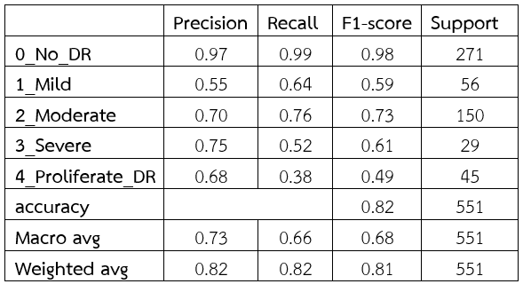

# 🧠 Classifying the Severity of Diabetic Retinopathy

This project focuses on detecting and classifying the severity of **Diabetic Retinopathy (DR)** from retinal fundus images using deep learning techniques. It uses transfer learning with EfficientNetB0 to classify the severity into 5 levels.

---

## 🔗 Try it on Google Colab

---
## 🚀 Features

- 🧠 Custom CNN architecture with `BatchNormalization` and `Dropout`
- 🩺 Trained on **5 severity levels** of **Diabetic Retinopathy** dataset (APTOS 2019 / Preprocessed)
- ✅ Achieved up to **80.04% test accuracy**

### 📊 Visualizations Included:
- Training Accuracy & Loss plots
- Confusion Matrix
- Classification Report
---

## 🧰 Tools & Tech Stack

- Python 3.8+
- TensorFlow / Keras
- EfficientNetB0
- Pandas, NumPy, OpenCV, Matplotlib, Seaborn

---

## 🗂 Dataset

- **Name**: APTOS 2019 Blindness Detection
- **Source**: [Kaggle](https://www.kaggle.com/competitions/aptos2019-blindness-detection)
- **Input**: Retinal fundus images
- **Output**: DR severity levels (0–4)

---

## 🧾 Preprocessing Details

This project uses retinal images from a pre-cleaned dataset:

- Dataset: [Diabetic Retinopathy Project – Preprocessed](https://www.kaggle.com/datasets/thitikornindee/diabetic-retinopathy-project/data?select=data_2classes)
- Color Mode: RGB
- Preprocessing Technique: CLAHE (Contrast Limited Adaptive Histogram Equalization)

This enhances the contrast of blood vessels and lesions in retinal images, improving model performance on classification tasks.

---
## 🧠 Model Configuration

- Architecture: EfficientNetB0
- Optimizer: AdamW
- Epochs: 100
- Batch Size: 32
- Learning Rate: 1e-5
- Activation Function: `tanh`

---

## 🧪 Data Augmentation

Used `ImageDataGenerator` with the following techniques:
- Rotation
- Horizontal Flip
- Zoom
- Shear
- Brightness Adjustment

---

## 🎯 Performance

### 📉 Confusion Matrix

---

### 📊 Accuracy & Validation Loss

Training and validation accuracy/loss over 100 epochs:

---

### 🧾 Classification Report

---

## 💡 Future Improvements

- Integrate Grad-CAM for visual explainability
- Deploy as a web app using Streamlit or FastAPI
- Add cloud deployment (e.g., HuggingFace, Render)

---

## 🙏 Acknowledgements

- APTOS 2019 Dataset
- TensorFlow/Keras community
- Google Colab

---

## 👨‍💻 Author

[@ncqxm](https://github.com/ncqxm)
